<div align="center">

# 🏸 Badminton Trainer

**纯本地、完全离线** 的私教级羽毛球训练 App · Expo + React Native · 一份代码 Web/iOS/Android

[](#-license)
[](https://reactnative.dev)
[](https://expo.dev)
[](https://www.typescriptlang.org)
[](#-它是什么)
[](./CHANGELOG.md)

<table>
  <tr>
    <td align="center">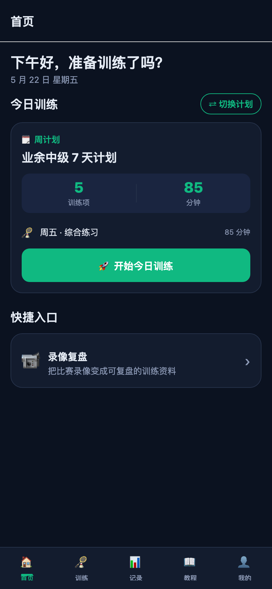</td>
    <td align="center">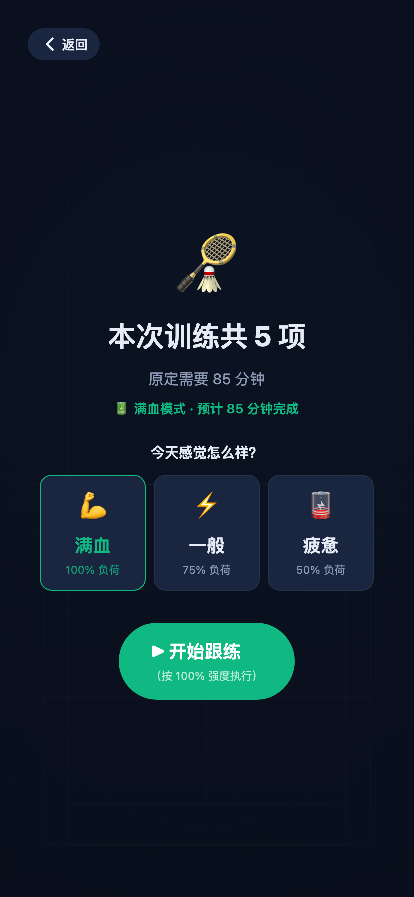</td>
    <td align="center">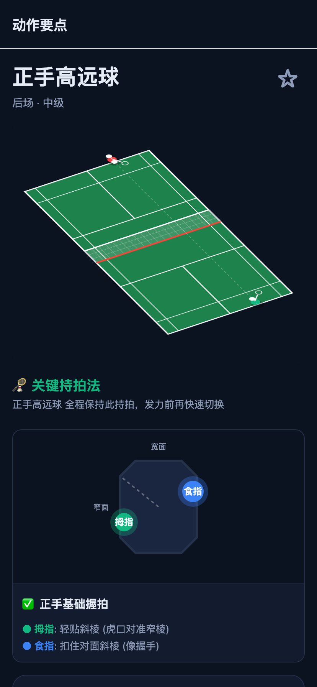</td>
  </tr>
</table>

</div>

---

## 🌟 它是什么

集 **私教式跟练计时** + **教练真人音** + **2.5D 鹰眼演示** + **职业级负荷预警** 于一身的离线版口袋私教。

- 🔌 **完全离线** —— 0 后端、0 账号、0 网络请求；地下二层球馆没信号也能开训
- 🎧 **教练真人音 (29 条)** —— macOS `say -v Tingting` 烘焙的本地 mp3，绕开 Android 系统 TTS 机械音
- 🎬 **2.5D 鹰眼演示** —— `react-native-reanimated` 纯代码绘制立体球场 + 物理抛物线，0 视频
- 📊 **A:C 运动负荷预警** —— 体能界「急慢性负荷比」，连续 28 天监控防伤病
- 🔥 **GitHub 风热力图 + 5 状态连击勋章** —— 满格金边脉动、空窗期温柔召回、破纪录吐司
- 💾 **一键 JSON 备份恢复** —— 直接对冲 Android 换 keystore 数据全清的根本风险
- 🎨 **设计系统化** —— `theme/tokens.ts` 字号/间距/色板单一真源；TS strict、零 `as any`

> 📜 历次迭代过程（46 轮 v0.48 → v0.2）见 [CHANGELOG.md](./CHANGELOG.md)

---

## 📸 界面一览

<table>
  <tr>
    <td align="center" width="25%"><br><sub>① 首页 · 私教任务卡</sub></td>
    <td align="center" width="25%">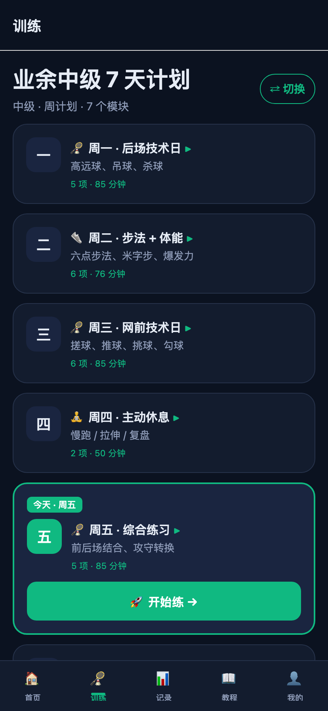<br><sub>② 训练 · 周历模式</sub></td>
    <td align="center" width="25%"><br><sub>③ 训练执行 · 体能 idle</sub></td>
    <td align="center" width="25%">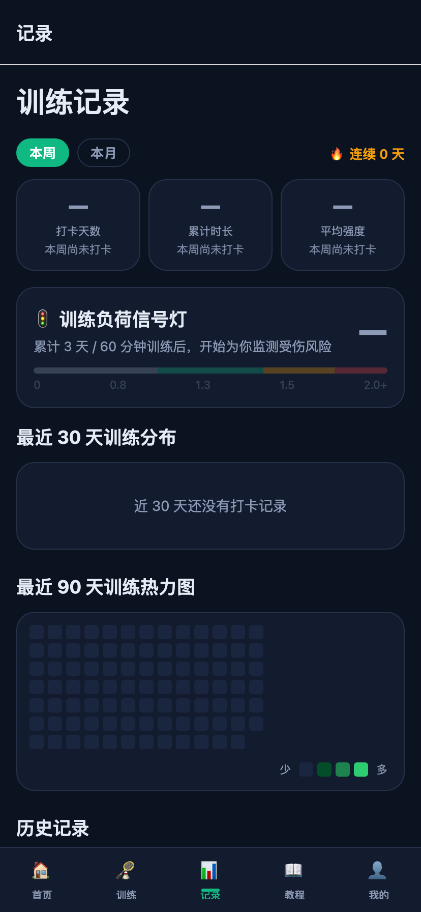<br><sub>④ 记录 · 时间舱</sub></td>
  </tr>
  <tr>
    <td align="center">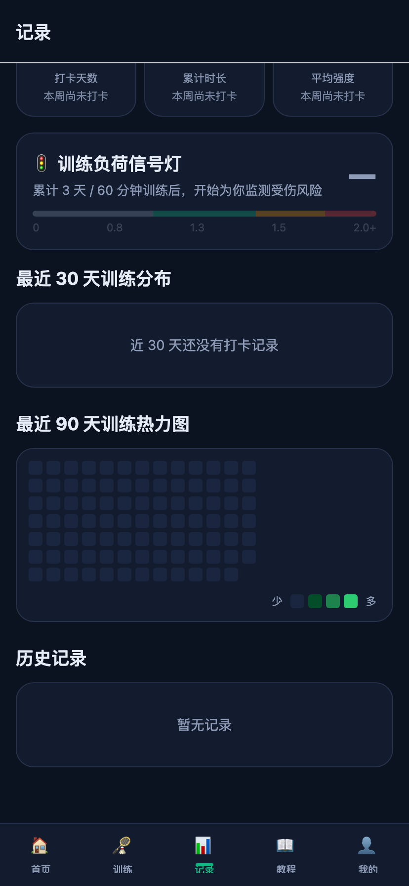<br><sub>⑤ 记录 · 90 天热力图</sub></td>
    <td align="center">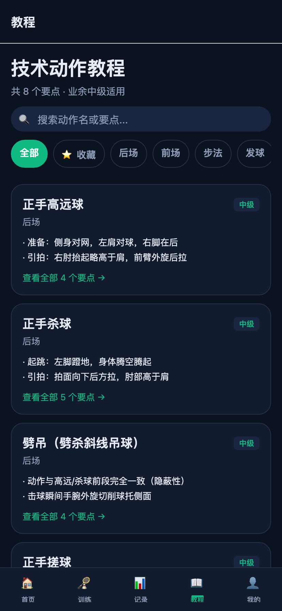<br><sub>⑥ 教程 · 分类 + 收藏</sub></td>
    <td align="center"><br><sub>⑦ 教程 · 2.5D 鹰眼 + 握拍</sub></td>
    <td align="center">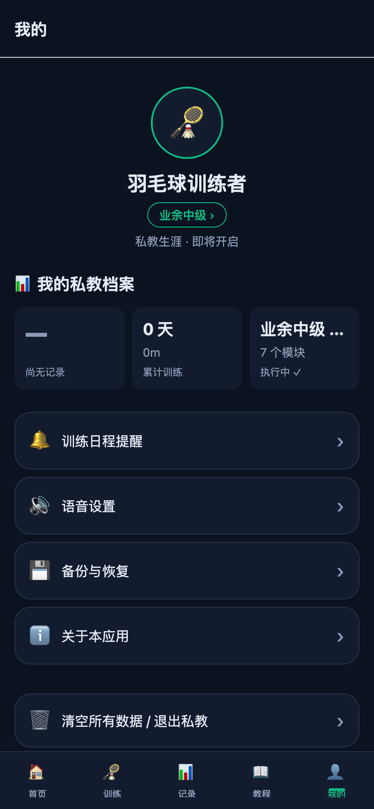<br><sub>⑧ 我的 · 私教档案</sub></td>
  </tr>
  <tr>
    <td align="center">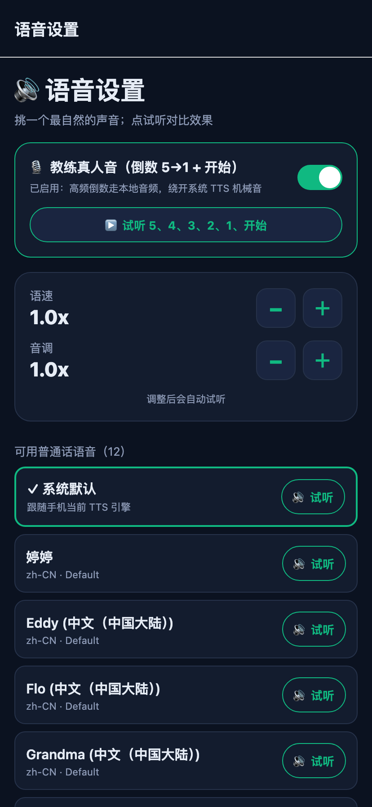<br><sub>⑨ 设置 · 教练真人音</sub></td>
    <td align="center">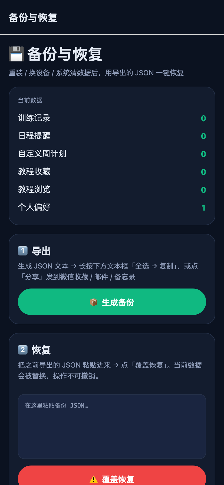<br><sub>⑩ 设置 · 一键 JSON 备份</sub></td>
    <td align="center">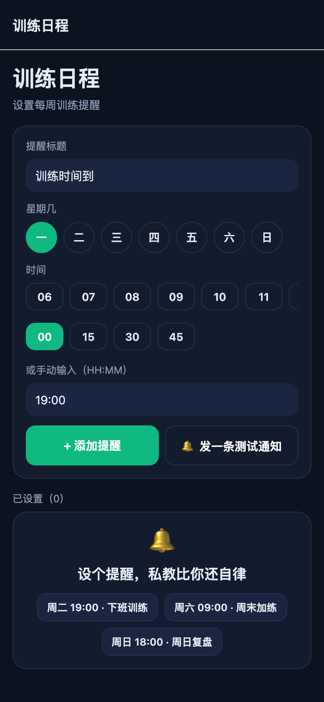<br><sub>⑪ 设置 · 训练日程</sub></td>
    <td align="center"><br><sub>⑫ 首启 · 30 秒上手</sub></td>
  </tr>
</table>

<sub>截图来自 Web 端 414×896@2x 移动视口，深色主题。运行 <code>node scripts/capture-screenshots.mjs</code> 一键重新生成。</sub>

---

## 🧭 功能导览

底部 **5 大 Tab** + 多个二级设置页，**全部离线可用**。

### 🏠 首页 — 私教任务卡 + 连击勋章

今日训练任务卡（source 标签 🗓/🎲/🎯 + 巨型双栏项数/分钟 + 模块行 + 🚀 CTA）· 5 状态连击勋章卡（A 满格金边脉动 / B-F 阶梯）· 3 天空窗期回归推荐 · 破纪录里程碑吐司 · 最近训练可点进详情 + 比上次 ±N 分钟对比小字。

### 🏸 训练 Tab — 三种节奏

| 模式 | 用途 | 视觉 |
|---|---|---|
| 🗓 **周计划** | 按周一~周日固定排表，今日卡 cardAlt 高亮 + ▶ + 🚀 开始练 | primary 主色 |
| 🎲 **每日随机** | 从模块池里抽 K 个练，避免每天踩同一个套路 | accent 描边 |
| 🎯 **自由模块池** | 点哪个练哪个，按心情来 | warn 描边 |

### 🎬 训练执行页 — 沉浸式跟练

| 阶段 | 体验 |
|---|---|
| **idle** | 球场网格背景 + 「本次训练共 N 项」 hero + 💪/⚡/🪫 三档体能（实时换算耗时，AsyncStorage 记忆上次值）|
| **preparing** | 教练真人音「五。四。三。二。一。开始」（绕开系统 TTS）|
| **running** | 顶部 3px 全局进度条 + 双层倒计时（项内/项间）+ Reanimated 弹性动画 + 3 套 BGM 下拉切换 + 挥拍木质击球音 + 步法球鞋摩擦音 |
| **transitioning** | `Next Up` 5 秒过渡卡 + 倒数呼吸圆 + 项间预览 + 「直接开始」跳过 |
| **paused** | 全屏半透明遮罩 + 实时已暂停时长 + 「跳过此项 / 结束训练」双 CTA |
| **finished** | 🏆 入场动画 + KPI 三列（实际时长/完成项数/完成率）+ 三档动态金句 + 连击预告 + inline 心得（140 字带到打卡）+ 「📅 安排下一次」留存入口 |

### 📊 记录 Tab — 职业级数据

| 卡片 | 关键算法/UI |
|---|---|
| 顶部 PeriodKPI 时间舱 | 本周/本月切换 + 同比 ▲▼ + Reanimated AnimatedNumber UI 线程跳数 |
| 🚦 训练负荷信号灯 | 体能界 A:C Ratio · 4 档 zone（不足/理想/偏高/高危）· 6px 横信号灯 + 游标 ▼ · 28 天 < 60min 或训练 < 3 天显 `—` 不误报 |
| 30 天分类分布横条图 | 按 categories 聚合 + max 归一化宽度 |
| 90 天热力图 | GitHub 风格 5 档色阶 |
| 历史记录区 | 按 YYYY-MM 倒序分组 + 5 个筛选 Pill + 卡片左 `MM-DD 周X`/分类 chip/对手/note，右 分钟+5 段 dot+intensity emoji，可点进详情 |
| 详情页 | 回顾 Section（vs 上次同类 / 本月累计 / 强度分位）+ 备注就地编辑（空/展示/编辑三态）+ 跨端二次确认删除 |

### 📖 教程 Tab — 私教手册

8 个核心动作（高远 / 杀 / 吊 / 搓 / 推 / 挑 / 步法 / 战术）。

- **顶部双横滑带**：⭐ 我的收藏 + ⏱ 最近浏览（每打开自动埋点）
- **分类过滤**：全部 / 后场 / 前场 / 步法 / 战术 / **⭐ 收藏**
- **搜索**：title + keyPoints 模糊匹配，与 category AND
- **详情页**：标题 + 数字角标（错误·N 条）+ Section 顺序（错误 → 要点 → 自检）+ **2.5D 鹰眼场地动画**（高远/杀球/吊球/挑球路径，物理抛物线 + 阴影 + 随机发球点）+ **八边形握拍透视图**（拇指/食指标注 + 苍蝇拍误区警示）+ 主 CTA「去训练 →」+ 次 CTA「去打卡 →」

### 👤 我的 Tab — 私教档案 + 设置

档案头（昵称内联编辑 + 业余/进阶/准专业三选一）+ 三连成就（最长连击 / 累计训练 / 当前计划）+ 5 项配置入口 ↓

| 设置项 | 内容 |
|---|---|
| 🗓 训练日程提醒 | 倒计时三态（今天/明天/周X）+ 时间 chip 同时段去重 + 测试通知 |
| 🔊 **教练真人音 + 语音设置** | toggle 真人音 (`prefs.useCoachAudio`) · 列出系统 zh-* voice 试听 + 选 + 语速/音调 ± · 试听文本 `"准备开始训练。五。四。三。二。一。开始"` 模拟训练真实节奏 |
| 💾 **备份与恢复** | 一键打 JSON（9 个 prefs + 5 张 SQLite 表）→ 分享微信/邮件 → 重装/换机粘贴恢复 |
| 🛡 数据隐私 | 独立确认页清空 5 项本地数据 |
| ℹ️ 关于本应用 | 版本号取自 `Constants.expoConfig?.version` 不硬编码 |

---

## 🛠️ 技术栈

| 层 | 技术 |
|---|---|
| 核心底座 | [Expo SDK 52](https://expo.dev) + [React Native 0.76](https://reactnative.dev)（Fabric/TurboModule 新架构） |
| 路由 | Expo Router 4（文件系统 + typedRoutes） |
| 本地存储 | `expo-sqlite` 7 张表 + AsyncStorage 偏好 · Web 端无缝降级 MemoryDB |
| 动画 | `react-native-reanimated` v3 + `react-native-svg`（60fps UI 线程） |
| 多媒体 | `expo-av` + `expo-speech` + `expo-haptics` · 29 条 macOS Tingting 烘焙教练音 mp3 |
| 沉浸式 | `expo-system-ui` + `expo-navigation-bar`（抹平 Android 全面屏底栏白边） |
| 类型 | TypeScript strict（无 `as any` / `@ts-ignore`） |
| 打包 | EAS Build cloud（preview profile，Android APK ≈ 20MB） |

---

## 🚀 快速开始

```bash
node -v   # 推荐 v18+
npm i -g expo-cli eas-cli

git clone https://github.com/jing-ge/badminton-trainer.git
cd badminton-trainer
npm install
```

### Web 端开发预览

```bash
npx expo start --web   # 浏览器开调，物理震动/音频会自动降级
```

### 真机调试

```bash
npx expo start         # Expo Go 扫码
npx expo run:android   # 本地编译装机
```

### EAS 云端打 APK

```bash
EXPO_TOKEN=xxx npx eas-cli build -p android --profile preview
```
项目已配置 `largeHeap=true` + 防 OOM；preview profile 出 APK 而非 AAB，方便侧载。

### 重新生成 README 截图

```bash
npx expo start --web    # 起 dev server (http://localhost:8081)

# 另一终端
node scripts/capture-screenshots.mjs   # 8 张基础页（Chrome headless + CDP，自动注 prefs.onboardingDone 跳引导）
node scripts/capture-extra.mjs         # 3 张需 scroll / 深路径
```

---

## 📁 目录结构

```text
badminton-trainer/
├── app/                          # Expo Router 文件路由（25+ 屏）
│   ├── (tabs)/                   # 5 大 Tab：index/train/stats/library/me
│   ├── training/run.tsx          # 训练执行页（idle/preparing/running/transitioning/paused/finished）
│   ├── tutorial/[id].tsx         # 教程详情（鹰眼 + 握拍）
│   ├── log/[id].tsx              # 训练详情（回顾 + 备注就地编辑）
│   ├── settings/                 # voice / backup / reset
│   ├── schedule/                 # 日程提醒
│   ├── replay/                   # 录像复盘 + 标注
│   └── onboarding.tsx            # 首启 3 屏引导
├── src/
│   ├── features/                 # 按功能拆 11 个模块
│   │   ├── run/                  # coachAudio + coachSpeech + TransitionScene
│   │   ├── streak/               # StreakBadgeCard 5 状态 + MilestoneToast
│   │   ├── library/              # TutorialStrip 横滑带
│   │   ├── plans/                # WeekOverviewCard 7 天总览
│   │   └── ...                   # fitness / pose / replay / schedule / stats / tutorial
│   ├── components/               # Screen / animations/TutorialMedia 等复用
│   ├── data/                     # plans / tutorials / fitness / intensity / presets
│   ├── db/                       # SQLite 7 张表（trainingLogs/schedules/tutorials/...）
│   ├── theme/tokens.ts           # 字号/间距/色板单一真源
│   └── utils/                    # haptics / notifications / format / streak
├── assets/
│   ├── audio/coach/              # 29 条教练真人音 mp3
│   └── images/                   # court_bg / icon / splash
├── scripts/
│   ├── gen-coach-audio.sh        # macOS say -v Tingting 烘焙
│   └── capture-{screenshots,extra}.mjs   # CDP 自动化截图
├── docs/
│   └── screenshots/              # README 11 张实拍图（自动生成）
├── CHANGELOG.md                  # 46 轮迭代日志
└── AGENTS.md                     # ralph 协作规则
```

---

## 💡 核心实现亮点

<details>
<summary><b>🎧 教练真人音引擎（绕开 Android TTS 机械音）</b></summary>

- **离线烘焙** — `scripts/gen-coach-audio.sh` 用 macOS `say -v Tingting` 一次性烘焙 29 条本地 mp3：3 状态短句 + 数字 0-20 + 5 句高频金句（"准备下一组" / "做得很好，继续保持" / "训练已暂停" / "好，休息三十秒" / "过半了，坚持住"），总体积 ~296KB 常驻 bundle
- **运行时分发** — [`coachAudio.ts`](src/features/run/coachAudio.ts) 进程级单例 + 整组预加载，`CoachClipName` 联合类型 + `digitToClip(n)` 0-20，> 20 fallback `Speech.speak`
- **训练页 6 处定串切换** — 休息开始 / 过半提醒 / 收尾 / 切下一组 / 30s 鼓励 / 暂停提示，全部走 `cueClip()`，**90% 固定文案不再受手机 TTS 引擎限制**
- **toggle 兜底** — 「我的 → 🔊 语音设置」可关 `prefs.useCoachAudio` 回退用户挑的 zh-CN voice + 语速/音调微调
</details>

<details>
<summary><b>🎬 2.5D 鹰眼演示（react-native-reanimated 纯代码绘制）</b></summary>

- **完全抛弃远程视频** — 教程详情页用 [`react-native-svg`](https://github.com/software-mansion/react-native-svg) + Reanimated 共享值在 UI 线程绘制立体球场（透视梯形 + 中线 + 网带 + 边线 + 服务区）
- **物理抛物线** — 高远 / 杀 / 吊 / 挑各自的 3D 飞行轨迹符合羽毛球真实物理：杀球短而急、吊球弧顶低、高远球抛物线高
- **动态高度阴影** — 球在抛物线顶端阴影最大最虚，落地时阴影最实
- **随机发球点** — 每次播放从 6 个真实场上位置随机切，避免视觉重复
- **GripGuide 八边形握拍** — 自带专属球拍截面 SVG，高亮拇指（绿）+ 食指（蓝）发力位置 + 苍蝇拍误区警示
</details>

<details>
<summary><b>📊 A:C Ratio 运动负荷预警</b></summary>

- **算法** — 借鉴 Tim Gabbett 急慢性负荷比理论：A=近 7 天平均训练负荷，C=近 28 天平均，A/C 比超过 1.5 = 损伤风险显著上升
- **4 档 zone** — < 0.8 不足 / 0.8-1.3 理想 / 1.3-1.5 偏高 / >1.5 高危，分别对应 textDim/primary/warn/danger 4 色
- **6px 横信号灯条** — 4 段语义色按 ratio 区间分配空间宽度（35/30/20/15）+ 游标 ▼ 实时位置
- **样本守卫** — 28 天 < 60min 或训练 < 3 天显 `—` + 灰色 + 「累计 N 天 / X 分钟训练后开始监测」，**不数据不足就误报高危**
- **私教语气** — 标题从「运动伤病预警 (A:C 比值)」改为「🚦 训练负荷信号灯」，高危从「⚠️ 风险极高！」改为「🔥 建议本周减量并增加恢复项，给身体一个缓冲」
</details>

<details>
<summary><b>🔥 5 状态连击勋章 + 里程碑吐司</b></summary>

- **deriveStreakView** — [`StreakBadgeCard.tsx`](src/features/streak/StreakBadgeCard.tsx) 5 状态优先级匹配（A 满格 7+ 天连击金边脉动 / B 进行中 / C 接近达成 / D 回归提示 / F 还没开始）
- **getStreakStats** — [`trainingLogs.ts`](src/db/trainingLogs.ts) 单次 SQLite 查询 + 内存计算：current / best / todayDone / firstDay
- **MilestoneToast** — 破纪录或整数天数（7/14/30...）会从顶部弹一次 Reanimated `FadeInDown`，同 session fingerprint 去抖不重复
- **新用户友好** — daysSinceLast === -1（从未打卡）首页直接隐藏 streak 卡，避免 F 状态噪音
</details>

<details>
<summary><b>🐛 Android MIUI 硬件层吞 emoji 血泪</b></summary>

- **症状** — v0.40 / v0.45 两次踩雷：训练 idle 三档体能按钮在 MIUI 真机上**胶囊轮廓正常但 emoji + 文字全部不渲染**，Web 端完全正常
- **根因** — Android RN 已知 bug：嵌套不同色背景（外层 cardAlt + 内层 transparent + 选中 primary 实色填充）+ `useNativeDriver` transform 触发硬件层升级，部分 ROM 合成路径吞子节点 Text 的 ColorEmoji 字体
- **v0.41 局部修复** — 删 `elevation: 3`，靠 rgba(255,255,255,0.08) + textDim 边框对比度（Δ19/256，超人眼可辨阈值 3 倍）
- **v0.48 完整回退** — 完全回到 v0.39 单层基线：内层 cardAlt 实色 + 1px border、选中只换边框不换背景、删 3 个 `<Animated.View>` scale 包装。代价是失去弹性反馈，换 emoji 必然可见
- **样式块注释升级为血泪 5 条** — v0.41/v0.42/v0.45/v0.48 时间线 + 守则「不要再叠嵌套背景层和 native-driver transform」
</details>

<details>
<summary><b>💾 一键备份对冲 keystore 数据清光</b></summary>

- **背景** — v0.40 EAS 切到新账号生成新 keystore → Android 把新签名 APK 当全新应用 → AsyncStorage + SQLite 全部清空 → 用户挑过的 voice / 训练日志 / 计划全丢，**这是 Android 签名机制的正常行为，非 app bug**
- **一键打 JSON** — [`backup.tsx`](app/settings/backup.tsx) 序列化 9 个 prefs + 5 张 SQLite 表（training_logs / schedules / user_plans / tutorial_favorites / tutorial_views）
- **跨端分享** — 调系统 share sheet 直接发到微信收藏 / 邮件 / 备忘录
- **覆盖恢复** — 粘贴 JSON → 红色覆盖按钮（明示不可撤销）→ 全量替换数据
</details>

---

## 🤝 贡献

如果你既是羽毛球重度爱好者又是开发者，欢迎 PR——更燃的短音频 Loop、新步法训练模块、更炫战术板动画都收。本仓库已经过 5 轮 ralph 协作迭代（产品 → 开发 → 测试），协作规则见 [`AGENTS.md`](./AGENTS.md)。

## 📄 License

[MIT](./LICENSE)

<div align="center">
<sub>Made with 🏸 · Built to train, not to scroll</sub>
</div>
